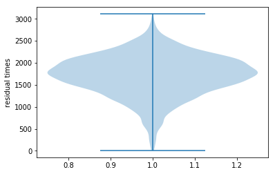

# CCS
# Simulation

Input: Enrollment data from college read as excel. Ensure the name is same in the code or just change the name of the file
Output: Distribution of weekly residual times for students

variables to specify:
1. sample size
2. activity combination size

functions:

1. class_times
function for extracting class times over the week for a randomly chosen student key value. 

2. allocation
Total allocations = 9. In each allocation following steps are followed.
    1. random.multivariate() function is used for selecting random values from a distribution 
       and assigned to an activity variable 
    2. the variable is added to the dictionary (my_dict) under the appropriate key
    3. a timer (timer) is used to record the time of the day that is spent
    4. dict bottom is updated to be used only for plotting later

Blocks:

1. reading input --> file name specified into pandas.read_excel()
2. preprocessing --> All data cleaning is performed here. 
3. simulation and violin plot block

Simulation block:

1. specify sample size
2. specify activities size
3. for each person in sample:
    a. calculate class times using class_times function
    b. for each activity for each person
        i. allocate avtivity times for all 9 types using allocation() function
        ii. calculate residual times and store

